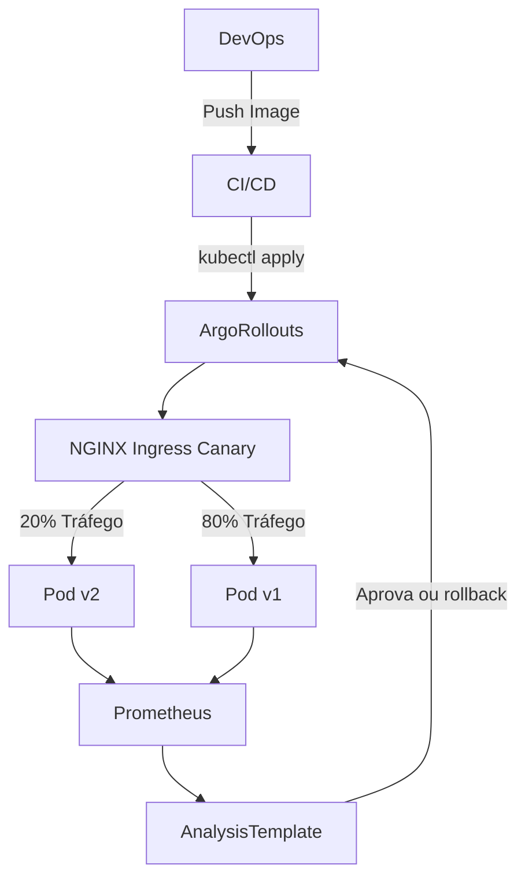
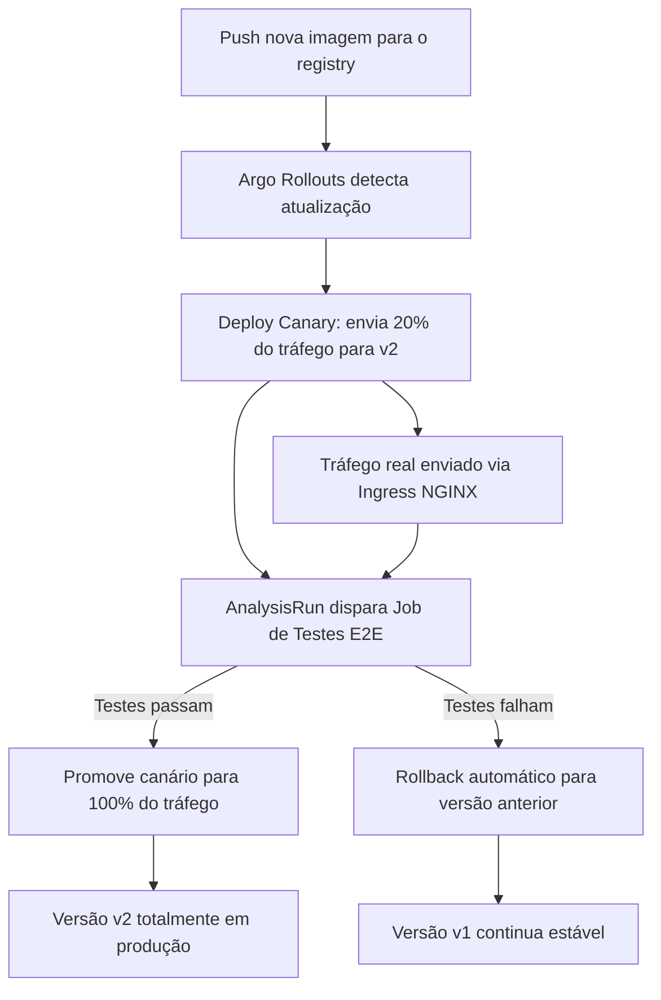

```mermaid
graph TD
    Dev[DevOps] -->|Push Image| CI/CD
    CI/CD -->|kubectl apply| ArgoRollouts
    ArgoRollouts --> CanaryIngress[NGINX Ingress Canary]
    CanaryIngress -->|20% Tráfego| CanaryPod[Pod v2]
    CanaryIngress -->|80% Tráfego| StablePod[Pod v1]
    CanaryPod --> Prometheus
    StablePod --> Prometheus
    Prometheus --> AnalysisTemplate
    AnalysisTemplate -->|Aprova ou rollback| ArgoRollouts
```

```mermaid
flowchart TD
    A[Push nova imagem para o registry] --> B[Argo Rollouts detecta atualização]
    B --> C[Deploy Canary: envia 20% do tráfego para v2]
    C --> D[AnalysisRun dispara Job de Testes E2E]
    D -->|Testes passam| E[Promove canário para 100% do tráfego]
    D -->|Testes falham| F[Rollback automático para versão anterior]
    E --> G[Versão v2 totalmente em produção]
    F --> H[Versão v1 continua estável]
    
    %% Extras
    C --> I[Tráfego real enviado via Ingress NGINX]
    I --> D
```
