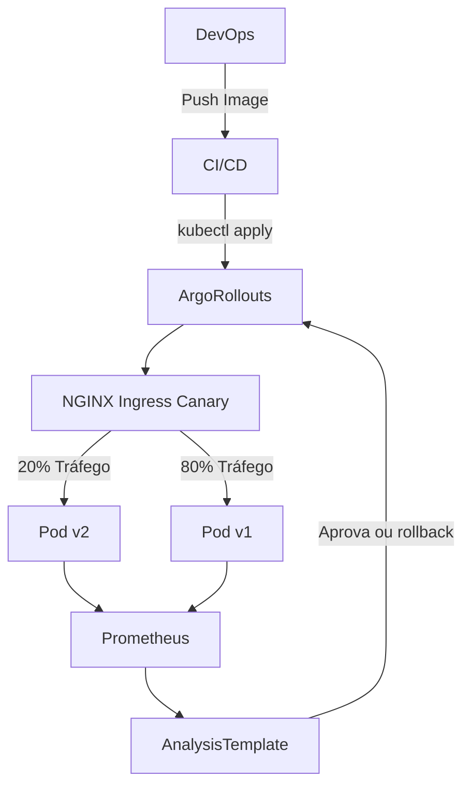

```mermaid
graph TD
    Dev[DevOps] -->|Push Image| CI/CD
    CI/CD -->|kubectl apply| ArgoRollouts
    ArgoRollouts --> CanaryIngress[NGINX Ingress Canary]
    CanaryIngress -->|20% Tráfego| CanaryPod[Pod v2]
    CanaryIngress -->|80% Tráfego| StablePod[Pod v1]
    CanaryPod --> Prometheus
    StablePod --> Prometheus
    Prometheus --> AnalysisTemplate
    AnalysisTemplate -->|Aprova ou rollback| ArgoRollouts
```
