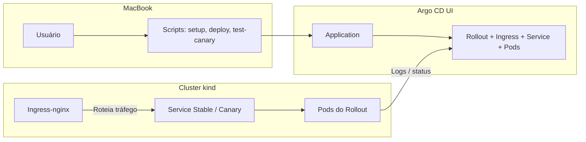

```mermaid
flowchart LR
    subgraph MacBook
        A[Usuário] --> B[Scripts: setup, deploy, test-canary]
    end

    subgraph "Cluster kind"
        C[Ingress-nginx] -->|Roteia tráfego| D[Service Stable / Canary]
        D --> E[Pods do Rollout]
    end

    subgraph "Argo CD UI"
        F[Application] --> G[Rollout + Ingress + Service + Pods]
        B --> F
    end

    E -->|Logs / status| G
```